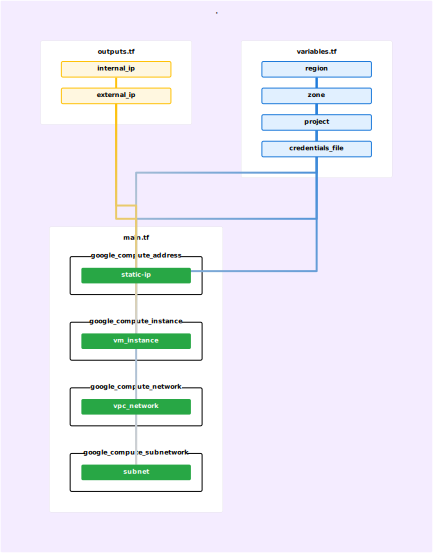

# terraform-my-handson

- reference
  - [TerraForm 公式 インストール](https://developer.hashicorp.com/terraform/downloads)
  - [TerraForm 公式 GCPチュートリアル](https://developer.hashicorp.com/terraform/tutorials/gcp-get-started/infrastructure-as-code)

<br>

- gcpのサンプル
```
cd learn-terraform-gcp
```

- terraformで作った構成を図示したい。
```
//zsh

terraform graph | dot -Tpng >| architecture.png
```
うーんビミョい...  

<br>

- [Rover -Terraform Visualizer](https://github.com/im2nguyen/rover)
を使う。

```
cd learn-terraform-gcp
docker run --rm -it -p 9000:9000 -v $(pwd):/src im2nguyen/rover
```



